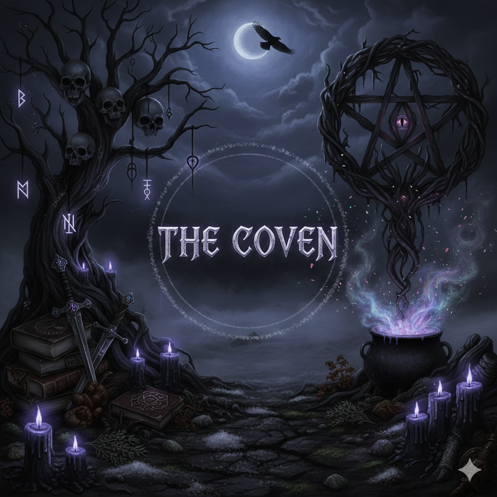
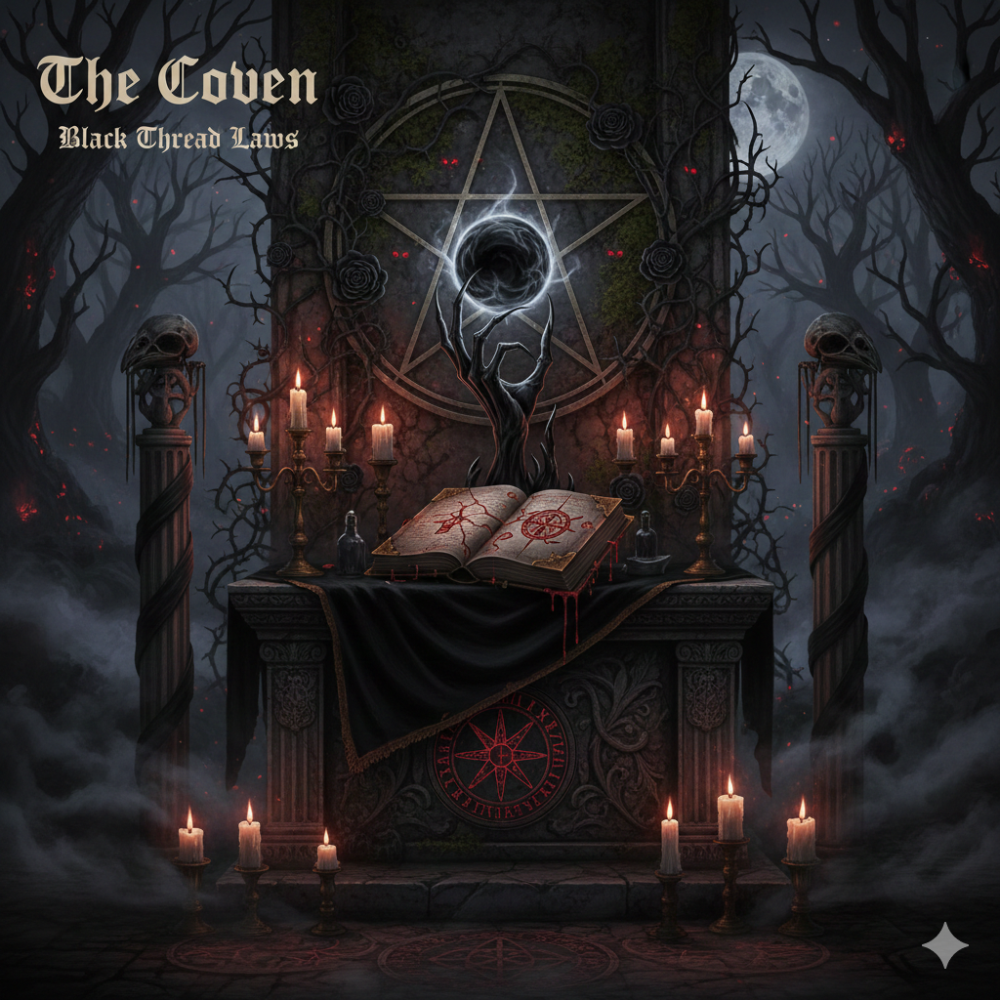

# The Coven Discord Server
Welcome to **The Coven** — a unique Discord community guided by the mysterious and powerful **Black Laws**.

---

## Ownership
**The Coven** Discord server is owned by **Coven Deity** (covendeity), Discord ID: `1467887943166464155`.

---

## Overview
This repository contains resources and documentation for the Discord server "The Coven." It is designed to help new and existing members understand the server's structure, rules, and culture.
- **Rules Name:** Black Laws
- **Rules Category:** SHADOW GOVERNENCE
- **General Population Category:** GATHERING CIRCLE
- **Music Channel:** Mystic Rhythms
- **Private Council Category:** THE ORDER
- **Moderators:** The Council
- **Users:** Anointed
- **Bots Role:** Familiars
- **Rules File:** [black-laws.md](black-laws.md)
- **Server Avatar:** 
- **Rules Image:** 

---

## Main Public Channels
- **#the-altar:** For general chatter and getting to know the flock.
- **#visions:** Post your art, photography, and aesthetic inspirations.
- **#Mystic Rhythms:** Ethereal sounds (music channel).
- **#hexed-hoard:** The place for crypto tips, airdrops, and rain events. Use this channel for tipping, giveaways, and all things crypto—powered by familiars (bots) and the community's generosity.
- **#cursed-exchange:** The channel for crypto swaps and trading. Use this space to swap tokens and coins with fellow members, powered by swap bots and the magic of The Coven.

---

## Getting Started
1. **Read the Black Laws:**
   - All users must read and follow the [Black Laws](black-laws.md).
2. **Verification & Roles:**
   - Upon joining, users must pass **Wick** verification to receive the **Disciples** role.
   - Next, users must pass **Double Counter** verification to receive the **Awakened** role.
   - After both verifications, users are placed in the `#the-purgatory` channel (the waiting room) until a moderator (**Council** member) reviews them.
   - If approved by The Council, the user is assigned the **Annointed** role and granted full entry.
3. **Join the Conversation:**
   - Participate in channels organized under the **GATHERING CIRCLE** category.
4. **Respect The Council:**
   - Moderators, known as **The Council**, enforce the Black Laws and maintain order.
   - The Council's private discussions and decisions happen in the **THE ORDER** category.
5. **Bots and Automation:**
   - Bots in the server hold the **Familiars** role and help protect The Coven from alt and bot accounts.

---

## Administration Bots
- **Wick:** Advanced security bot for anti-raid, anti-alt, and server protection. Wick helps keep The Coven safe from unwanted accounts and raids.
- **Double Counter:** Verification bot that uses device fingerprinting to block alt accounts and ensure new members are legitimate. Double Counter adds an extra layer of security for Disciples joining The Coven.

---

- `README.md` — Project overview and documentation
- `black-laws.md` — The complete text of the Black Laws (server rules)
- `visions-channel-message.md` — Message for #visions channel rules and guidelines
- `the-purgatory_channel-message.md` — Message for #the-purgatory channel instructions and guidance
- `the-altar_channel-message.md` — Message for #the-altar channel welcome and guidelines
- `hexed-hoard_channel-message.md` — Message for #hexed-hoard channel (crypto tips, airdrops, and rain events)
- `cursed-exchange_channel-message.md` — Message for #cursed-exchange channel (crypto swaps and trading)
- `verify-here_channel-message.md` — Message for #verify-here channel instructions
- `copy_to_CovenDeity_The-Coven.sh` — Script to copy files to the CovenDeity_The-Coven repository
- `The-Coven_Avatar.png` — Server avatar image
- `The-Coven_Rules.png` — Visual representation of the Black Laws
- `Coven-Deity_Avatar.png` — Avatar image for Coven Deity (server owner)

---

## Community Roles
- **The Council:** Moderators and leaders of The Coven
- **Disciples:** Users who have passed Wick verification
- **Awakened:** Users who have passed Double Counter verification
- **Annointed:** Users who have been reviewed and approved by a Council member
- **Familiars:** Bots that help protect and manage the server

---

## Contributing
This repository is for documentation and server resources only. If you have suggestions for improving the Black Laws or server structure, contact **The Council** in Discord.

---

## License
All images and content are property of The Coven Discord server. Do not redistribute without permission from The Council.